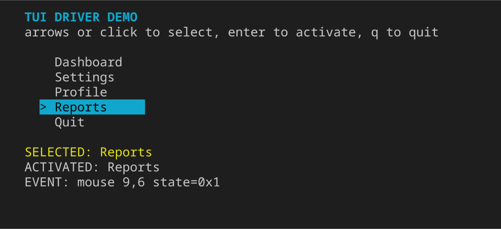

# tui-driver

Drive, see and snapshot **any** terminal UI through tmux — built so a coding agent can open a TUI,
look at what is on the screen, click on it, navigate it, and keep watching it over time.

The agent never needs a terminal of its own. Every operation is a one-shot CLI command that prints
the current screen as plain text, so it composes with the plain shell access every agent already has.

```
tui start --name app -- htop        # launch a TUI, detached, at a fixed size
tui snap app                        # print what is on screen right now
tui keys app Down Down Enter        # press keys
tui click app --text "Settings"     # click the cell where that text is drawn
tui wait app --text "Saved"         # block until the screen says something
tui watch app --interval 500ms      # keep recording every change in the background
tui render app --out shot.png       # rasterise a frame so the agent can *look* at it
```



That image was produced by the commands above — `tui click`, then `tui render`. Colour, the reverse
video on the selected row, and the mouse event the app received are all real.

## Requirements

- **`tmux` ≥ 3.2.** That is what `new-session -e` needs; `capture-pane -N` needs 3.1 and
  `resize-window` needs 2.9. Verified on 3.5a and 3.6a.
- **`bun` ≥ 1.3.11.**
- **Linux or macOS.** Windows is not supported natively — the tool is a tmux driver. WSL is fine.
- Optional, for PNG output: `rsvg-convert` (`librsvg2-bin` on Debian/Ubuntu, `librsvg2-tools` on
  Fedora, `brew install librsvg` on macOS) **or** ImageMagick **or** Chrome.
  Without any of them, `--svg` still works with zero dependencies, and `tui doctor` reports it as a
  warning rather than a failure.

Run `tui doctor` to check all of this at once.

## Install

```bash
curl -fsSL https://raw.githubusercontent.com/evandrocabf/tui-driver/main/install.sh | bash
```

That puts `tui` and `tui-driver` on your PATH and installs the skill into every coding agent it
finds. It writes nothing you did not ask for, prints every path as it goes, and is undone by
`install.sh --uninstall`.

From a checkout, run it directly — it installs from where it stands rather than cloning:

```bash
git clone https://github.com/evandrocabf/tui-driver.git && cd tui-driver
./install.sh --dry-run     # see the plan first
./install.sh
```

| Option                                  |                                                                |
| --------------------------------------- | -------------------------------------------------------------- |
| `--agents claude,codex`                 | pick agents instead of auto-detecting                          |
| `--all`                                 | install for every supported agent, detected or not             |
| `--project [DIR]`                       | install into a project's `.claude/skills/…` instead of `$HOME` |
| `--no-agents` / `--no-bin`              | just the CLI / just the skill                                  |
| `--prefix DIR`                          | where the CLI shim goes (default `~/.local/bin`)               |
| `--dir DIR`                             | where to clone (default `~/.local/share/tui-driver`)           |
| `--ref REF` / `--repo URL`              | install a specific tag, branch or fork                         |
| `--copy`                                | copy the skill instead of symlinking it                        |
| `--dry-run` / `--uninstall` / `--force` |                                                                |

The CLI is installed as a three-line shim that execs `bun` on the checkout, so **`git pull` is the
whole update story** — symlinked skills follow the checkout automatically. `--copy` installs do not,
by design.

Prefer to do it by hand? Nothing here needs an installer:

```bash
bun install     # dev tooling only; the CLI itself has zero runtime dependencies
bun link        # puts `tui` and `tui-driver` on your PATH (undo with `bun unlink`)
```

Agents can also just call the CLI directly: `bun run /path/to/tui-driver/bin/tui.ts <command>`.

## Agent integration

**Why this is agent-agnostic.** The only capability an agent needs is the ability to run a shell
command. There is no MCP server to host, no daemon to keep alive, no SDK to import, and no
tool-calling convention to match — `tui snap app` is a command that prints text, which every coding
agent on the market can already do. Anything an agent can learn from a `SKILL.md`, it can drive.

The instructions live in **one** file, versioned with the tool: `skills/tui-driver/SKILL.md`. Every
agent below reads that same file — nothing to keep in sync, and `install.sh` only ever links to it.

| Agent                    | Installed to                            | Loading   | How it fires                |
| ------------------------ | --------------------------------------- | --------- | --------------------------- |
| Claude Code              | `~/.claude/skills/tui-driver/`          | on demand | automatic                   |
| Codex CLI                | `~/.codex/skills/tui-driver/`           | on demand | automatic                   |
| Cursor                   | `~/.cursor/skills/tui-driver/`          | on demand | automatic, or `/tui-driver` |
| opencode                 | `~/.config/opencode/skills/tui-driver/` | on demand | automatic                   |
| Gemini CLI / Antigravity | `~/.gemini/skills/tui-driver/`          | on demand | automatic                   |
| _any AGENTS.md agent_    | `~/.agents/skills/tui-driver/`          | on demand | automatic                   |
| Cline                    | `~/Documents/Cline/Rules/tui-driver.md` | always on | always present              |
| Windsurf                 | `.windsurf/rules/tui-driver.md`         | always on | `--project` only            |

### Using it

You do not invoke this by name. Skills fire on **what you ask for**, matched against the
`description` line — so describe the goal and let the agent reach for it:

> "Run `htop` and tell me which process is using the most memory."
> "Start our CLI wizard, click through to the last step, and show me a screenshot."
> "Does the settings screen still render correctly at 80x24?"
> "Write me a repeatable test that the dashboard loads and shows no errors."

If an agent does not pick it up, name the tool once — _"use tui-driver to …"_ — and it will. In
Cursor you can also force it with `/tui-driver`.

"On demand" is what you want: only the `description` line costs context until the agent decides it
needs the skill. Cline and Windsurf have no skill loader — only always-on rules directories — so
their copy is read on every request. Windsurf's one global slot is a shared 6,000-character file
that is not ours to own, so it is project-scoped only.

`~/.agents/skills/` is the emerging cross-tool convention, read by opencode, Cursor and
Gemini/Antigravity alike. It is installed even when no specific agent is detected.

### An agent that is not on the list

There is nothing special about the agents above — they are just the ones whose skill directories
`install.sh` knows. For anything else, either point its rules/skills directory at the same file:

```bash
ln -s "$PWD/skills/tui-driver" ~/.config/<agent>/skills/tui-driver   # a skill loader
ln -s "$PWD/skills/tui-driver/SKILL.md" <its-rules-dir>/tui-driver.md # an always-on rules dir
```

…or skip installation entirely and paste this into the prompt:

> Read `<path>/skills/tui-driver/SKILL.md` and follow it. The `tui` command is on PATH.

Both give the agent exactly what every agent above gets.

### Per-project instead of per-user

`--project DIR` installs into a repository rather than your home directory, creating whichever of
`.claude/skills/`, `.codex/skills/`, `.cursor/skills/`, `.agents/skills/`, `.clinerules/` or
`.windsurf/rules/` that project already uses.

This repo deliberately ships only one such entry point, and it is the vendor-neutral one:

```
AGENTS.md -> skills/tui-driver/SKILL.md
```

No `.claude/`, no `.cursor/`, no `.codex/`. A tool that claims to be agent-agnostic should not
privilege one vendor's directory in its own root, and `AGENTS.md` is the standard the widest range
of agents already read. If you want an in-repo skill directory for your own agent, `install.sh
--project .` creates it — it is just not committed here.

Two caveats about that symlink: git checkouts on Windows turn it into a plain text file unless
`core.symlinks` is enabled, and npm tarballs do not preserve it at all. Neither matters in practice
— it points at `skills/tui-driver/SKILL.md`, which is a real file and ships as one.

### Checking it took

```bash
tui doctor                                   # the tool itself
ls -l ~/.claude/skills/tui-driver             # or whichever agent you installed for
./install.sh --dry-run                       # prints every path, changes nothing
```

Then ask your agent _"what does `htop` look like right now?"_ — if it runs `tui start` rather than
hanging on a bare `htop`, it is wired up.

## The loop an agent runs

1. **`tui start`** — launch the TUI. Returns once the screen has actually been drawn, then prints it.
2. **`tui snap`** — read the screen. Add `--ruler` to get row/column numbers for aiming clicks.
3. **`tui find <text>`** — turn on-screen text into coordinates.
4. **`tui keys` / `tui type` / `tui click`** — act. Add `--snap` to print the resulting screen in the
   same command, so one call is one full turn.
5. **`tui wait --text ... --stable ...`** — synchronise instead of sleeping and hoping.
6. **`tui stop`** — done. And if you never get there, the session stops itself (see below).

A complete turn in one command:

```bash
tui click app --text "Save" --snap        # click, settle, print the new screen
```

## Commands

| Command            | What it does                                                                  |
| ------------------ | ----------------------------------------------------------------------------- |
| `start`            | Launch a command in a detached, fixed-size tmux session                       |
| `ls`               | List running sessions, their size, state and recorder                         |
| `snap`             | Capture the screen: text, ANSI, JSON, and optionally an image                 |
| `keys`             | Send key presses (`Down`, `C-c`, `Escape`, `F5`, `ctrl+c`, `^c`, …)           |
| `type`             | Type literal text                                                             |
| `paste`            | Paste a block, with bracketed paste by default                                |
| `click`            | Mouse click at a cell, or at matching on-screen text                          |
| `move`             | Move the pointer (motion event)                                               |
| `drag`             | Press, move through intermediate cells, release                               |
| `scroll`           | Mouse wheel, in any of the four directions                                    |
| `find`             | Locate text and report clickable coordinates                                  |
| `wait`             | Block until text appears/disappears, the screen settles, or the process exits |
| `watch`            | Record every screen change in the background                                  |
| `frames` / `frame` | List and print recorded frames                                                |
| `render`           | Rasterise a frame (or the live screen) to PNG/SVG                             |
| `diff`             | Compare two frames, or a frame against the live screen                        |
| `resize`           | Change the terminal size                                                      |
| `stop` / `clean`   | Kill a session / delete its artifacts                                         |
| `keepalive`        | Push back a session's auto-stop deadline                                      |
| `gc`               | Kill sessions whose lease ran out (also runs before every command)            |
| `run`              | Execute a YAML or JSON scenario                                               |
| `doctor`           | Check tmux, terminfo and image rendering                                      |

`tui help <command>` prints the options for any of them.

## Sessions expire by themselves

A TUI outlives the command that started it — that is the whole point of a detached session, and it
is also how a forgotten `tui start` leaves a full process tree (bun, node, python, whatever the app
is) running for hours. So cleanup is not left to the caller:

- Every session gets a **10-minute lease**. `tui ls` shows what is left of it, and `tui start`
  prints it.
- A tiny `sh` watchdog is armed next to each session and kills it when the lease runs out, with no
  CLI call needed. It re-reads the deadline as it polls, so extending one takes effect immediately,
  and it exits as soon as the session is gone.
- Every `tui` command also sweeps first, so a session whose watchdog was killed dies at the next
  command at the latest. Sessions with no lease at all — started by an older version, or by hand —
  fall back to the same 10 minutes measured from tmux's own creation time.
- When the last session dies, the tmux server exits with it. Nothing is left behind.

```bash
tui start --ttl 30m -- ./myapp   # ask for a longer lease upfront (60m ceiling)
tui keepalive app 20m            # extend a running session
tui gc                           # reap expired sessions now
tui gc --max-age 0               # last resort: kill everything, lease or not
```

`--ttl` cannot disable expiry. If you want immortal sessions on your own machine, set
`TUI_DRIVER_TTL=never` (or any duration) in the environment — that is a human decision, not one an
agent driving the CLI can make for you. Acting on an expired session gives you exit code 4 and an
error that says it expired, so the next move is to start it again rather than hunt for a typo.

## Mouse

Mouse support is real: the click is encoded in the wire protocol **the TUI itself turned on**, and
injected into the pane as raw bytes.

tmux reports which mode the application enabled, so the encoding is auto-detected per event:

- `sgr(1006)` — the modern encoding, no coordinate limit. Preferred when available.
- `utf8(1005)` — legacy UTF-8 encoding.
- `x10` — the original byte encoding. Coordinates above column/row 94 are unreliable and the CLI
  warns when you cross that line.

Tracking level is reported too — `normal(1000)`, `button-event(1002)`, `any-event(1003)` — and every
snapshot header shows it:

```
── app · 64x14 · cursor 10,11 (hidden) · python3 · mouse button-event(1002)/sgr(1006) · +2.2s
```

If the TUI never enabled mouse reporting, `mouse off` appears in the header and mouse commands warn
that the event will be ignored rather than silently doing nothing.

**Coordinates are 0-based**, matching the JSON snapshot and `--ruler` output. Column 0 row 0 is the
top-left cell. The wire protocol's 1-based values are handled internally.

```bash
tui click app 12 4                       # by coordinate
tui click app --text "OK"                # by label, clicks the centre of the match
tui click app --text "OK" --at start     # or its first cell
tui click app --text "row" --nth 2       # the third match
tui click app 5 5 --button right         # right click
tui click app 5 5 --count 2              # double click
tui click app 5 5 --modifiers ctrl+shift # with modifiers
tui move  app 20 6                       # hover
tui drag  app 1 1 40 10 --steps 8        # drag with intermediate motion events
tui scroll app --down --amount 5         # wheel
```

## Images

The ANSI capture is the source of truth and is always stored, so **any frame can be rendered to an
image later** — you do not have to decide up front.

```bash
tui snap app --png                  # capture and rasterise now
tui render app last --out shot.png  # rasterise a frame recorded earlier
tui render app --svg --out shot.svg # vector, no external tool needed
tui render app -3 --theme light --scale 3 --out big.png
```

Rendering is a self-contained ANSI → SVG renderer (256-colour palette, truecolor, bold, dim, italic,
underline, strikethrough, reverse, the cursor block, and double-width CJK cells), rasterised by
whichever backend is installed.

**Images never land in your working directory unless you ask.** Without `--out`, both `snap --png`
and `render` write into the session's own frame store under `$XDG_STATE_HOME/tui-driver/`, and print
the full path. That matters because these commands are normally run from inside the project being
driven: the alternative is a stray `app-live.png` in someone else's repo. `tui clean <name>` deletes
a session's artifacts, and `--out` still aims anywhere you like.

## Recording over time

```bash
tui watch app --interval 500ms                 # background recorder, a frame per change
tui watch app --interval 1s --keep 200 --png   # rolling window, with images
tui watch app --status
tui watch app --stop
tui frames app --last 10
tui diff app -1 live
```

The recorder only writes when the screen actually changed (frames are content-hashed), so an idle
TUI costs nothing on disk. `tui start --record 500ms` starts one along with the session.

## Scenarios

A scenario is a repeatable script — the "tester" half of the tool.

```yaml
name: menu-smoke
command: ["python3", "tests/fixtures/menu.py"]
size: 64x14

steps:
  - wait: { text: "TUI DRIVER DEMO", timeout: 10s }
  - expect: { text: "SELECTED: Dashboard" }
  - snap: 01-boot

  - keys: [Down, Down]
  - wait: { stable: 250ms }
  - expect: { text: "SELECTED: Profile" }

  - click: { text: "Reports" }
  - wait: { stable: 250ms }
  - expect: { text: "ACTIVATED: Reports" }
  - snap: { label: 02-reports, png: true }

  - golden: menu-reports

  - keys: [q]
  - wait: { exit: true, timeout: 5s }
```

```bash
tui run examples/menu-smoke.yaml                   # exit 1 if any step fails
tui run examples/menu-smoke.yaml --update-golden   # rewrite the golden screens
```

Top-level keys besides `steps`: `name`, `command` / `shell`, `cwd`, `size`, `env`, `session`,
`settle`, `record`, `goldenDir`, and `ttl` for a scenario that legitimately runs longer than the
default 10-minute lease. The session is stopped when the run ends — including when it ends badly —
unless `--keep` is passed, and even then it expires like any other.

Steps: `wait`, `sleep`, `snap`, `keys`, `type`, `paste`, `click`, `move`, `drag`, `scroll`,
`resize`, `expect`, `golden`. A failing step stops the run, prints the offending screen, and writes
`report.json` plus the actual screen next to the golden.

## Where things live

```
$XDG_STATE_HOME/tui-driver/          # override with TUI_DRIVER_HOME
├── tmux.sock                        # a private tmux server, isolated from yours
├── tmux.conf                        # status bar off, no key bindings, panes kept after exit
└── sessions/<name>/
    ├── session.json                 # command, cwd, size, start time, lease
    ├── frames.jsonl                 # one line per frame
    ├── frames/<stamp>[-label].txt   # plain text
    ├── frames/<stamp>[-label].ansi  # ANSI, the source for rendering
    └── watcher.json                 # recorder pid, if running
```

The tmux server is entirely separate from any tmux you are running: its own socket, its own config,
no key bindings, no status bar. It cannot interfere with your sessions.

You can still attach and watch a session live — `tui start` prints the exact command:

```
tmux -S ~/.local/state/tui-driver/tmux.sock attach -t app
```

The window size is pinned, so attaching from a differently-sized terminal does not change what the
TUI sees.

## Exit codes

| Code | Meaning                                                                                                    |
| ---- | ---------------------------------------------------------------------------------------------------------- |
| 0    | success                                                                                                    |
| 1    | condition not met — `wait` timed out, `find` matched nothing, a scenario step failed, `diff` found changes |
| 2    | usage error                                                                                                |
| 3    | missing dependency (tmux, or no rasterizer for `--png`)                                                    |
| 4    | no such session                                                                                            |

## Notes from building this

- **`window-size manual` segfaults tmux 3.6a** when set in the config at server start. Setting it on
  an already-created window is fine, so the size is pinned right after `new-session` instead.
- **`Bun.file(path).exists()` returns `false` for unix sockets.** Liveness checks use
  `existsSync` from `node:fs`.
- Unix socket paths are capped near 108 bytes; a long `TUI_DRIVER_HOME` falls back to a hashed name
  under the temp dir.
- tmux's `capture-pane -e` resets SGR at the start of every line, so the parser does the same rather
  than carrying style across rows.
- Metadata and screen content are fetched in a **single** tmux invocation
  (`display-message … ';' capture-pane`), so the cursor position always belongs to the screen you
  are looking at.
- `--settle` alone is a race: a slow TUI has not drawn yet. `start` waits for the screen to become
  non-empty first, and `wait --stable` exists so you never have to guess.
- **tmux accepts a `-f` config file that does not exist, and exits 0.** A server then comes up on
  tmux's own defaults — no `remain-on-exit`, so `wait --exit` can never see the process die. The
  config writer is keyed to the resolved path for that reason, not to a "have we done this" flag.

## How this compares

**Against `expect` / `pexpect`.** Those drive a stream; this drives a _screen_. If your program is
line-oriented, expect is simpler and you should use it. Once the program repaints, positions the
cursor, and listens for the mouse, matching on a byte stream stops working — you need the rendered
screen, and that is what tmux gives us.

**Against [`tui-tester`](https://github.com/luxquant/tui-tester)** (unrelated project, similar idea):
it is a TypeScript library you import into Vitest or Jest, with adapters for Node, Deno and Bun. If
you want to write TUI assertions inside a test suite you already have, that is the shape you want —
this tool has no importable API yet.

What is different here: mouse events are encoded in the protocol the application itself turned on
(SGR, UTF-8 or x10, detected per event through tmux's mode flags) and injected as raw bytes, with the
exact wire bytes verified end to end; the tmux server is private, with its own socket and config, so
it cannot collide with the sessions or key bindings you already have; there is a self-contained
ANSI → SVG → PNG renderer, so an agent can _look_ at the TUI rather than only read it; and
synchronisation is explicit (`wait --stable`, `wait --exit`, content-hashed frames) instead of
sleeping and hoping. Being a one-shot CLI rather than a library is the point: it composes with any
agent, shell or CI step without a long-lived process to hold.

## Development

```bash
bun run typecheck
bun run test              # unit + integration (integration skips without tmux/python3)
bun run test:coverage     # what CI gates on
bun run format
```

See [CONTRIBUTING.md](CONTRIBUTING.md) for the layout of the code and the conventions.

`tests/fixtures/menu.py` is a small curses app used by the integration tests and the example
scenario — it needs at least 58x12 to draw, and aborts below that. `tests/fixtures/mouse-echo.sh`
echoes the raw mouse bytes it receives, which is how the wire encoding is verified end to end.
